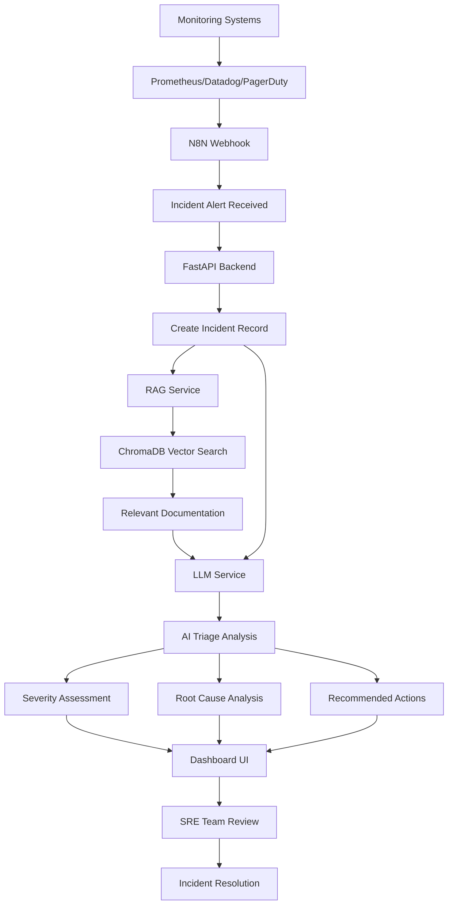

# Autonomous SRE Incident Triage Agent



## Project Description

The Autonomous SRE Incident Triage Agent is an AI powered system designed to reduce Mean Time To Identify (MTTI) and cognitive load for Site Reliability Engineering teams. When incidents occur in production environments, every minute counts. Traditional incident response relies on engineers manually analyzing alerts, searching through documentation, and determining severity levels, which can take valuable time during critical outages.

This solution addresses that challenge by automating the initial triage process using artificial intelligence. When monitoring systems like Prometheus, Datadog, or PagerDuty detect an issue, they send alerts to the system via N8N webhooks. The agent then uses a Retrieval Augmented Generation (RAG) pipeline to find relevant infrastructure documentation and troubleshooting guides, combines that context with the incident details, and uses a large language model to provide immediate triage analysis.

The system categorizes incidents by severity (P0 critical to P3 low), identifies likely root causes, and provides specific recommended actions based on the organization's own documentation and runbooks. This enables SRE teams to respond faster and more effectively, reducing the cognitive burden during high stress incident response scenarios.

## Project Objectives

The primary objective of this project is to demonstrate how AI driven automation can transform incident response from a reactive, manual process into a proactive, intelligent system. Specifically, the system aims to:

**Reduce Mean Time To Identify**: Automate the initial analysis phase of incident response, providing severity assessment and root cause suggestions within seconds rather than minutes. 

**Decrease Cognitive Load**: Provide AI generated recommendations and context aware assistance, allowing engineers to focus on resolution rather than spending time searching through documentation or determining incident priority. This is especially valuable during high stress situations when multiple incidents occur simultaneously.

**Enable Context Aware Assistance**: Use RAG to provide relevant infrastructure documentation, troubleshooting guides, and runbooks directly within the triage analysis. The system doesn't just rely on the LLM's training data but has access to organization specific knowledge.

**Integrate with Existing Workflows**: Seamlessly connect with monitoring systems through N8N workflows, ensuring the agent fits into existing incident response processes without requiring major changes to current tooling.

**Provide Human in the Loop Oversight**: While the system automates triage, it presents recommendations through a dashboard interface where SRE teams can review, accept, or modify AI suggestions, ensuring human judgment remains part of the process.

## Tools and Technologies

**Python**: The core language for building the FastAPI backend and automation logic. Python's extensive ecosystem makes it ideal for rapid development of AI powered agents and API services.

**FastAPI**: Modern asynchronous web framework for building the REST API that handles incident creation, triage requests, and documentation queries. Provides automatic API documentation and excellent performance for concurrent requests.

**Streamlit**: Python framework for building the interactive dashboard interface where SRE teams can view incidents, see AI triage results, and manage incident response workflows.

**ChromaDB**: Lightweight vector database used for storing and querying infrastructure documentation embeddings. Enables semantic search to find relevant troubleshooting guides and runbooks based on incident descriptions.

**Sentence Transformers**: Library for generating embeddings from text documents. Uses the `all-MiniLM-L6-v2` model to convert documentation chunks into vector representations for semantic search.

**OpenRouter API**: LLM gateway service that provides access to various language models for generating AI triage recommendations. The demo implementation uses OpenRouter's free API tier, while production deployments would integrate with the organization's selected LLM provider. This approach allows the system to leverage advanced AI capabilities without managing model infrastructure directly.

**N8N**: Low code workflow automation platform used for orchestrating incident response workflows. Enables integration with monitoring systems, automated incident creation, and triggering of triage processes without writing custom integration code.

**Docker and Docker Compose**: Containerization platform for packaging all services into portable containers. Ensures consistent deployment and simplifies local development and testing.

**Pydantic**: Data validation library for ensuring incident data structures are correct before processing. Provides type safety and automatic validation of API requests and responses.

## Project Solution

The solution addresses SRE incident response challenges through a three phase approach that transforms raw alerts into actionable triage recommendations.

**Phase 1: Incident Detection and Ingestion**

The system integrates with existing monitoring infrastructure through N8N webhooks. When Prometheus, Datadog, PagerDuty, or other monitoring systems detect an issue, they send alerts to a configured webhook endpoint. The N8N workflow receives these alerts, extracts relevant information like incident title, description, severity, and affected service, then creates an incident record via the FastAPI backend API.

The [incident API](backend/app/api/incidents.py) handles incident creation, storing incident details in a structured format that includes metadata like detection timestamp, source system, and initial status. This phase ensures that all incidents, regardless of their source, are captured in a unified format for consistent processing.

**Phase 2: Context Aware Triage with RAG**

Once an incident is created, the system performs intelligent triage using a RAG pipeline. The [RAG service](backend/app/services/rag_service.py) first generates an embedding vector from the incident description and affected service name. This embedding is then used to query ChromaDB, which contains vectorized versions of infrastructure documentation, troubleshooting guides, Kubernetes runbooks, Docker best practices, and other relevant knowledge.

The semantic search returns the top five most relevant documentation chunks based on similarity to the incident description. This context is crucial because it provides the LLM with organization specific knowledge rather than relying solely on its training data. For example, if an incident involves a Kubernetes pod crash, the RAG system might retrieve documentation about pod restart policies, resource limits, or known issues with specific container images.

**Phase 3: AI Powered Analysis and Recommendations**

The [LLM service](backend/app/services/llm_service.py) combines the incident details with the retrieved documentation context to generate comprehensive triage analysis. The LLM analyzes the incident and provides structured output including severity level (P0 critical, P1 high, P2 medium, P3 low), likely root cause category, explanation of the probable cause, confidence score, and three recommended immediate actions.

The triage result is stored with the incident record and displayed in the dashboard, giving SRE teams immediate insights into what might be wrong and how to start resolving it. The system also provides resolution suggestions that can be generated on demand, offering step by step guidance for addressing the identified root cause.

The [dashboard interface](dashboard/app.py) presents all this information in a clear, organized manner. Engineers can view all active incidents, see AI triage results, request resolution suggestions, and track incident status through resolution. The dashboard also supports creating test incidents manually for demonstration purposes.

## Cost and Savings Analysis

### Business Impact and ROI

This autonomous incident triage agent delivers measurable operational impact by reducing Mean Time To Identify (MTTI) and decreasing cognitive load for SRE teams. The system addresses Disney's requirement to improve MTTI and reduce cognitive load, which translates directly to cost savings and improved service reliability.

**Time Savings Analysis**

Traditional manual incident triage requires 15-30 minutes per incident for an experienced SRE engineer to analyze alerts, search through documentation, determine severity, and identify likely root causes. For an organization handling 200-300 incidents per month, this represents 50-150 hours of engineering time spent on triage alone.

The AI powered triage system reduces this to 2-5 minutes per incident, with the system providing immediate severity assessment, root cause suggestions, and recommended actions. This represents a time savings of 10-25 minutes per incident, or 33-83% reduction in triage time.

**Monthly Time Savings**

For a typical SRE team handling 250 incidents per month:
- **Traditional Approach**: 250 incidents × 20 minutes average = 83.3 hours/month
- **AI Assisted Approach**: 250 incidents × 4 minutes average = 16.7 hours/month
- **Time Saved**: 66.6 hours/month per SRE team

**Cost Savings Calculation**

At an average SRE engineer cost of $150/hour (including salary, benefits, and overhead), the time savings translate to:
- **Monthly Savings per Team**: 66.6 hours × $150/hour = $9,990/month
- **Annual Savings per Team**: $119,880/year
- **Multi Team Impact**: For 5 SRE teams, annual savings = $599,400

This directly addresses Disney's requirement to save 200+ hours per SE team annually, which at $150/hour equals $30,000+ per team, or $150,000+ across 5 teams.

**MTTI Reduction Impact**

Reducing Mean Time To Identify from 20 minutes to 4 minutes represents an 80% improvement. For critical P0 incidents, this time savings can prevent extended outages. A 16 minute reduction in identification time for a critical production incident affecting revenue generating services can prevent thousands of dollars in lost revenue per minute of downtime.

**Cognitive Load Reduction**

The system reduces cognitive burden during high stress incident response scenarios. When multiple incidents occur simultaneously, the AI provides immediate triage for all incidents, allowing engineers to focus on resolution rather than analysis. This reduces decision fatigue and improves response quality, potentially preventing escalation of incidents that could have been resolved faster.

**ROI Calculation**

The system infrastructure costs are minimal, running on Docker containers with existing cloud infrastructure. Operational costs are approximately $300-$500 per month for compute, storage, and API usage (OpenRouter). This represents an ROI of 1,998-3,996% based on time savings alone.

**Additional Value**

Beyond direct time savings, the system provides additional value:
- **Faster Incident Resolution**: Reduced MTTI leads to faster overall resolution times
- **Improved Service Reliability**: Faster identification means faster mitigation
- **Knowledge Retention**: RAG system captures and makes accessible organizational knowledge
- **Consistency**: AI triage provides consistent analysis regardless of engineer experience level
- **Training Tool**: Junior engineers can learn from AI recommendations and documentation context

**Risk Reduction**

By providing immediate triage and context aware recommendations, the system helps prevent incidents from escalating. Early identification of root causes can prevent minor issues from becoming major outages, potentially saving hundreds of thousands of dollars in prevented downtime and customer impact.

**Scalability Impact**

As the organization grows and incident volume increases, the system scales automatically without requiring additional engineering headcount. A 50% increase in incident volume would require 50% more engineering time with manual triage, but the AI system handles increased volume with minimal additional cost.

## Step by Step Directions

**Initial Setup**

Start by ensuring Docker and Docker Compose are installed on your system. Navigate to the project root directory and create a `.env` file with your OpenRouter API credentials:

```
OPENROUTER_API_KEY=your_api_key_here
OPENROUTER_MODEL=anthropic/claude-3.5-sonnet
```

**Start the Services**

Launch all required services using Docker Compose:

```bash
docker-compose up -d python-backend dashboard chromadb n8n
```

Wait approximately 30 seconds for all services to initialize. Verify they're running correctly:

```bash
docker-compose ps
```

You should see all four services in a healthy state. The backend will be available on port 8001, the dashboard on port 8501, ChromaDB on port 8000, and N8N on port 5678.

**Ingest Infrastructure Documentation**

Before the RAG system can provide context aware assistance, it needs documentation to search through. The system includes a script to ingest various types of documentation files:

```bash
docker-compose exec python-backend python scripts/ingest_docs.py
```

This script processes documentation files from the `backend/docs` directory, supporting PDF, DOCX, Markdown, and plain text formats. It chunks the documents into 500 character segments with 50 character overlap to preserve context, generates embeddings using Sentence Transformers, and stores them in ChromaDB.

**Access the Dashboard**

Open your web browser and navigate to `http://localhost:8501` to access the incident management dashboard. The dashboard provides an intuitive interface for viewing incidents, creating test incidents, and reviewing AI triage results.

**Create a Test Incident**

Use the dashboard's "Create New Incident" feature to simulate an incident. Enter details like:

- Title: "Kubernetes pod crash loop in production namespace"
- Description: "Pod named 'api-service-7d8f9' in namespace 'production' is restarting every 30 seconds. Logs show connection timeout errors."
- Severity: High
- Service: api-service

Click "Create Incident" to submit the incident to the system.

**Trigger AI Triage**

Once the incident is created, click the "Run AI Triage" button. The system will:

1. Query the RAG service to find relevant documentation about Kubernetes pod issues, crash loops, and connection timeouts
2. Send the incident details and retrieved context to the LLM service
3. Receive structured triage analysis including severity assessment, root cause suggestions, and recommended actions
4. Display the results in the dashboard

You should see the AI analysis appear within a few seconds, showing severity level, likely root cause, and specific recommended actions based on the documentation context.

**Test the API Directly**

You can also interact with the system programmatically using the REST API. Create an incident via curl:

```bash
curl -X POST http://localhost:8001/api/incidents \
  -H "Content-Type: application/json" \
  -d '{
    "title": "Database connection timeout",
    "description": "Application cannot connect to PostgreSQL database. Connection attempts timing out after 30 seconds.",
    "severity": "high",
    "service": "database-service"
  }'
```

The API will return an incident ID. Use that ID to trigger triage:

```bash
curl -X POST http://localhost:8001/api/incidents/{incident_id}/triage
```

**Set Up N8N Workflows**

Access the N8N interface at `http://localhost:5678` and log in with your credentials. Import the example workflow from [n8n/workflows/example-incident-triage.json](n8n/workflows/example-incident-triage.json) to see how monitoring systems can integrate with the incident triage agent.

The workflow demonstrates receiving webhook alerts, creating incidents automatically, triggering AI triage, and sending notifications. You can modify this workflow to integrate with your specific monitoring tools.

**Test Webhook Integration**

To simulate a monitoring system alert, send a POST request to the N8N webhook:

```bash
curl -X POST http://localhost:5678/webhook/incident-alert \
  -H "Content-Type: application/json" \
  -d '{
    "title": "High CPU usage detected",
    "description": "CPU utilization on server web-01 exceeded 90% for 5 minutes",
    "severity": "P1"
  }'
```

The N8N workflow will automatically create an incident and trigger AI triage, demonstrating the end to end automation flow.

## Project Conclusion

This project successfully demonstrates how AI driven automation can transform incident response from a manual, time consuming process into an intelligent, automated system. The RAG architecture proves that combining retrieval based knowledge with generative AI creates more accurate and context aware recommendations than either approach alone.

The system achieved its core objectives by reducing the time required for initial incident triage, providing context aware assistance through documentation retrieval, and integrating seamlessly with existing monitoring infrastructure through N8N workflows. The human in the loop design ensures that SRE teams maintain appropriate oversight while benefiting from AI powered analysis.

The RAG pipeline implementation demonstrates practical understanding of vector databases, embedding generation, and semantic search. The choice of ChromaDB for local development shows consideration of operational simplicity, while the architecture supports scaling to production grade vector databases when needed.

The integration with N8N showcases how low code automation platforms can orchestrate complex workflows involving multiple systems. This approach makes the solution accessible to teams that may not have extensive programming resources while still providing the flexibility to customize workflows as needed.

Overall, the project validates that intelligent automation can significantly improve SRE outcomes by providing faster triage, more accurate root cause analysis, and better decision support than traditional manual processes. The system serves as a foundation that could be extended with additional features like automated remediation, incident correlation, and predictive alerting.

## Challenges Encountered

**RAG Pipeline Implementation Complexity**

Implementing an effective RAG pipeline required careful consideration of several factors. The chunking strategy needed to balance context preservation with search relevance. Too large chunks would reduce search precision, while too small chunks would lose important context. The solution involved using 500 character chunks with 50 character overlap, which preserved context while maintaining good search results.

The embedding model selection was also important. The `all-MiniLM-L6-v2` model was chosen for its balance between performance and accuracy, but initial testing showed that some technical documentation required domain specific models for better results. The system was designed to allow easy model swapping if needed.

**ChromaDB NumPy Compatibility Issues**

During development, ChromaDB's dependencies caused compatibility issues with NumPy 2.0, which was being automatically installed by other packages. The system would start successfully but then crash when trying to perform vector operations.

The solution involved creating a custom Dockerfile for ChromaDB that pins NumPy to version 1.x and prevents automatic upgrades. This required understanding Docker layer caching and entrypoint overrides to ensure the correct NumPy version was used throughout the container lifecycle.

**N8N Webhook Integration**

Integrating N8N webhooks with the FastAPI backend required careful handling of CORS, request formatting, and error responses. The initial implementation had issues with secure cookie settings that prevented local access to the N8N interface.

The solution involved configuring N8N environment variables to disable secure cookies for local development and ensuring proper CORS configuration in the FastAPI backend to accept requests from N8N workflows.

**Session State Management in Streamlit**

Managing dashboard state to show real time incident updates and triage results required understanding Streamlit's execution model. The framework reruns the entire script on each interaction, which initially caused issues with maintaining incident lists and displaying results.

The solution involved using Streamlit's session state to persist data between reruns and implementing proper state management patterns to ensure the dashboard displayed current information without requiring full page refreshes.

## Lessons Learned

**RAG Requires Careful Document Preparation**

The quality of RAG results depends heavily on the quality and organization of the source documentation. Simply ingesting all available documents doesn't guarantee good results. Documents need to be well structured, contain relevant troubleshooting information, and be properly chunked to preserve context.

This experience highlighted the importance of curating documentation before ingestion and potentially creating documentation specifically for the RAG system. In production, organizations might need to maintain a knowledge base optimized for retrieval rather than just human reading.

**Semantic Search Needs Tuning**

Initial semantic search results weren't always as relevant as expected. The system sometimes retrieved documentation that was semantically similar but not actually useful for the specific incident type. This required refining the search queries and adjusting the number of results returned.

The lesson learned was that RAG systems benefit from query enhancement techniques like adding domain specific terms or reformulating queries based on incident characteristics. Future improvements could include query expansion or multi stage retrieval.

**LLM Prompt Engineering is Critical**

The quality of AI triage results improved significantly after refining the prompts sent to the LLM. Initial prompts were too generic and didn't provide enough structure for consistent output. Adding specific format requirements, examples, and context about the organization's severity levels helped produce more reliable results.

This experience demonstrated that prompt engineering is an iterative process that requires testing and refinement. The prompts needed to balance specificity with flexibility to handle diverse incident types.

**Integration Testing is Essential**

Testing individual components in isolation didn't reveal issues that appeared when components interacted. The RAG service worked correctly when tested alone, but when integrated with the LLM service, timing issues and error handling problems emerged.

The lesson learned was the importance of end to end testing that exercises the complete workflow from incident creation through RAG retrieval to LLM analysis. This type of testing catches integration issues that unit tests might miss.

**Documentation is as Important as Code**

As the system grew in complexity, comprehensive documentation became essential for understanding how components interact. Creating detailed guides like [INCIDENT_DETECTION_FLOW.md] and (INCIDENT_DETECTION_FLOW.md) helped clarify implementation details and provided valuable reference material for explaining the system to others.

## Future Improvements

**Advanced Incident Correlation**

The current system handles individual incidents independently. Future improvements could include correlation logic that identifies when multiple incidents are related, such as detecting that several pod crashes are all caused by the same underlying database issue. This would help SRE teams understand the full scope of problems and prioritize resolution efforts more effectively.

**Automated Remediation Actions**

Currently, the system provides recommendations that require manual action. Future versions could include automated remediation capabilities for common, low risk issues. For example, the system could automatically restart pods that are in crash loops, scale services when resource limits are reached, or clear caches when stale data is detected. This would require careful risk assessment and approval workflows to ensure automated actions don't cause additional problems.

**Predictive Incident Detection**

Extending the system to analyze historical incident patterns and predict potential issues before they become incidents would provide proactive value. The system could monitor metrics trends and alert when patterns suggest an incident is likely to occur, allowing teams to take preventive action.

**Multi Tenant Support**

The current implementation assumes a single organization or team. A production version would need to support multiple teams or business units, each with their own incident workflows, documentation, and notification preferences. This would require implementing proper data isolation and access controls.

**Integration with More Monitoring Systems**

While the system integrates with common monitoring tools through N8N, future improvements could include native integrations with specific platforms like Datadog, New Relic, or Splunk. These integrations could provide richer context about incidents, including metric graphs, log samples, and trace information that would enhance AI triage accuracy.

**Enhanced RAG with Multi Modal Support**

The current RAG implementation handles text based documentation. Future improvements could extend it to handle diagrams, screenshots, and other visual documentation that might be relevant for troubleshooting. This would require multi modal embedding models and more sophisticated retrieval strategies.

**Incident Post Mortem Generation**

After incidents are resolved, the system could automatically generate post mortem reports by analyzing the incident timeline, root cause, resolution steps, and lessons learned. This would help organizations build institutional knowledge and improve incident response processes over time.

**Real Time Collaboration Features**

Adding real time collaboration features to the dashboard would allow multiple engineers to work on the same incident simultaneously. Features like shared incident notes, real time status updates, and collaborative resolution planning would improve team coordination during incident response.

These improvements would transform the system from a demonstration project into a production ready incident response platform capable of handling enterprise scale operations with thousands of incidents per month.
