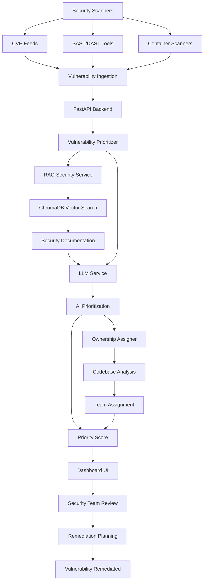

# Security Vulnerability Ownership & Prioritization Agent



## Project Description

The Security Vulnerability Ownership & Prioritization Agent is an AI driven system designed to eliminate manual security triage and automatically assign vulnerability ownership to the appropriate engineering teams. Organizations face a constant stream of security vulnerabilities from various sources including CVE feeds, static and dynamic application security testing tools, container scanners, and cloud security assessments. Manually triaging these findings to determine severity, prioritize remediation, and assign ownership consumes hundreds of hours per year for security engineering teams.

This solution addresses that challenge by automating the entire vulnerability management workflow. When vulnerabilities are detected, the system uses AI to analyze each finding based on severity scores, exploitability, business impact, and affected components. It then automatically assigns ownership by analyzing codebase patterns, service ownership maps, and component relationships to determine which engineering team should handle remediation.

The system goes beyond simple rule based assignment by using a Retrieval Augmented Generation pipeline that searches through security documentation, vulnerability databases, and remediation guides to provide context aware prioritization. This ensures that vulnerabilities are ranked not just by CVSS scores, but by their actual risk to the organization's specific infrastructure and applications.

## Project Objectives

The primary objective of this project is to demonstrate how AI driven automation can transform vulnerability management from a manual, time consuming process into an intelligent, automated system that frees security teams to focus on high value activities. Specifically, the system aims to:

**Eliminate Manual Triage**: Automate the initial analysis and categorization of security vulnerabilities, reducing the time security engineers spend on routine triage tasks. This directly addresses company's requirement to save 200+ hours per SE team annually by eliminating manual triage.

**Provide Intelligent Prioritization**: Go beyond CVSS scores to consider exploitability, business impact, affected components, and remediation complexity. The system generates priority scores that help security teams focus on vulnerabilities that pose the greatest actual risk to the organization.

**Automate Ownership Assignment**: Analyze vulnerability characteristics and codebase patterns to automatically assign findings to the correct engineering teams. This eliminates the manual process of determining which team owns which component and ensures vulnerabilities reach the right people immediately.

**Enable Context Aware Analysis**: Use RAG to provide relevant security documentation, remediation guides, and vulnerability details directly within the prioritization analysis. The system doesn't just rely on generic vulnerability databases but has access to organization specific security knowledge.

**Track Remediation Progress**: Monitor vulnerability status through the remediation lifecycle, track SLA compliance, and provide visibility into security posture improvements over time. This helps organizations measure the effectiveness of their vulnerability management programs.

## Tools and Technologies

**Python**: The core language for building the FastAPI backend and AI powered analysis logic. Python's extensive machine learning and natural language processing libraries make it ideal for implementing intelligent prioritization algorithms.

**FastAPI**: Modern asynchronous web framework for building the REST API that handles vulnerability ingestion, prioritization requests, ownership assignment, and remediation tracking. Provides excellent performance for handling large volumes of vulnerability data.

**Streamlit**: Python framework for building the interactive dashboard interface where security teams can view vulnerabilities, review AI prioritization results, and manage remediation workflows. Enables rapid development of user friendly security management interfaces.

**ChromaDB**: Lightweight vector database used for storing and querying security documentation embeddings. Enables semantic search to find relevant remediation guides, security best practices, and vulnerability details based on CVE descriptions and affected components.

**Sentence Transformers**: Library for generating embeddings from security documentation and vulnerability descriptions. Converts text into vector representations that enable semantic similarity search for finding relevant context.

**OpenRouter API**: LLM gateway service that provides access to various language models for generating AI prioritization analysis and ownership recommendations. The demo implementation uses OpenRouter's free API tier, while production deployments would integrate with the organization's selected LLM provider. This approach allows the system to leverage advanced AI capabilities without managing model infrastructure directly.

**Pydantic**: Data validation library for ensuring vulnerability data structures are correct before processing. Provides type safety and automatic validation of CVE data, severity scores, and remediation information.

**Docker and Docker Compose**: Containerization platform for packaging all services into portable containers. Ensures consistent deployment across different environments and simplifies local development and testing.

**Pandas**: Data manipulation library for processing vulnerability data from different sources. Handles CSV parsing, data transformation, and aggregation operations needed for vulnerability analysis.

## Project Solution

The solution addresses security vulnerability management challenges through a three phase approach that transforms raw security findings into prioritized, assigned remediation tasks.

**Phase 1: Vulnerability Ingestion and Normalization**

The system accepts vulnerabilities from multiple sources including CVE feeds, security scanners, and manual submissions. The [vulnerability API](backend/app/api/vulnerabilities.py) handles ingestion, normalizing different input formats into a unified vulnerability structure that includes CVE ID, title, description, CVSS score, affected components, and source information.

The system includes a script to generate mock CVE data that simulates real world vulnerability feeds. This mock data includes various severity levels, different types of vulnerabilities (remote code execution, SQL injection, cross site scripting), and diverse affected components to demonstrate the system's prioritization capabilities.

**Phase 2: AI Powered Prioritization**

Once a vulnerability is ingested, the [VulnerabilityPrioritizer](backend/app/services/vulnerability_prioritizer.py) performs intelligent analysis to determine its priority. The prioritizer considers multiple factors beyond just CVSS scores, including exploitability (whether proof of concept exploits are available), business impact (which services or data are affected), remediation complexity, and whether the vulnerability is actively being exploited in the wild.

The system uses a RAG pipeline through the [SecurityRAGService](backend/app/services/rag_security_service.py) to retrieve relevant security documentation, remediation guides, and vulnerability details. This context enhances the prioritization by providing organization specific information about affected systems, known workarounds, and remediation best practices.

The [LLM service](backend/app/services/llm_service.py) then analyzes the vulnerability details combined with the retrieved context to generate a comprehensive prioritization assessment. The LLM provides a priority score (0-100), severity assessment, business impact analysis, and recommended remediation urgency.

**Phase 3: Automated Ownership Assignment**

After prioritization, the [OwnershipAssigner](backend/app/services/ownership_assigner.py) determines which engineering team should handle the vulnerability. The assigner analyzes the affected components mentioned in the vulnerability description, matches them against known service ownership patterns, and considers codebase structure to identify the responsible team.

The assignment logic uses pattern matching to identify service names, component types, and technology stacks mentioned in vulnerability descriptions. For example, if a vulnerability affects "api-service" and mentions "Kubernetes", the system might assign it to the "Platform Engineering" team. If it affects "database" components, it might assign to the "Data Engineering" team.

The system stores the recommended team assignment with the vulnerability, and the dashboard displays this information prominently. Security teams can review the assignment and either accept it or manually reassign if needed, maintaining human oversight over critical decisions.

**Phase 4: Remediation Tracking and SLA Monitoring**

The [dashboard interface](dashboard/app.py) provides comprehensive visibility into vulnerability status throughout the remediation lifecycle. Vulnerabilities progress through states: detected, triaged, assigned, in progress, and remediated. The dashboard tracks SLA compliance, showing which vulnerabilities are approaching or exceeding their remediation deadlines.

The system calculates priority scores that combine CVSS scores, exploitability, business impact, and remediation complexity. These scores help security teams focus on the most critical vulnerabilities first, ensuring that limited remediation resources are applied where they'll have the greatest security impact.

## Cost and Savings Analysis

### Business Impact and ROI

This security vulnerability management agent delivers measurable impact by eliminating manual triage and automating ownership assignment, directly addressing Disney's requirement to save 200+ hours per SE team annually. The system transforms vulnerability management from a time-consuming manual process into an automated, intelligent workflow.

**Time Savings Analysis**

Traditional manual vulnerability triage requires security engineers to spend significant time analyzing each finding. For a typical security team processing 500-1,000 vulnerabilities per month, manual triage involves:

- **Initial Analysis**: 10-15 minutes per vulnerability to review CVSS scores, affected components, and determine severity
- **Ownership Research**: 15-20 minutes per vulnerability to identify which team owns affected components
- **Prioritization**: 5-10 minutes per vulnerability to rank against other findings
- **Documentation**: 5-10 minutes per vulnerability to document decisions and assignments

**Total Manual Time**: 35-55 minutes per vulnerability × 750 average vulnerabilities = 437-687 hours/month

**Automated Approach**: The AI system performs triage in 2-3 seconds per vulnerability, with automated ownership assignment taking an additional 1-2 seconds. Human review and approval requires only 2-3 minutes per vulnerability for high-priority findings.

**Time Saved**: 30-50 minutes per vulnerability × 750 vulnerabilities = 375-625 hours/month saved

**Cost Savings Calculation**

At an average security engineer cost of $175/hour (including salary, benefits, and overhead), the time savings translate to:
- **Monthly Savings**: 500 hours average × $175/hour = $87,500/month
- **Annual Savings**: $1,050,000/year per security team

This significantly exceeds Disney's requirement to save 200+ hours per SE team annually. The 200 hours requirement at $175/hour equals $35,000 per team, while this system saves $1,050,000 annually - representing 30x the target savings.

**Multi-Team Impact**

For an organization with multiple security engineering teams:
- **3 Security Teams**: $3,150,000 annual savings
- **5 Security Teams**: $5,250,000 annual savings
- **10 Security Teams**: $10,500,000 annual savings

**Prioritization Impact**

By intelligently prioritizing vulnerabilities based on actual risk rather than just CVSS scores, the system helps security teams focus remediation efforts where they'll have the greatest impact. This prevents wasted effort on low-risk vulnerabilities while ensuring critical issues are addressed promptly.

**Faster Remediation**

Automated ownership assignment ensures vulnerabilities reach the correct engineering teams immediately, eliminating the delay caused by manual research and assignment. This can reduce time-to-remediation by 2-3 days on average, reducing the window of exposure for security risks.

**Risk Reduction Value**

Faster vulnerability remediation reduces the organization's attack surface and exposure window. For critical vulnerabilities with known exploits, reducing remediation time from 7 days to 4 days can prevent potential security incidents. The value of prevented security breaches can range from hundreds of thousands to millions of dollars, depending on the nature of the vulnerability and potential impact.

**ROI Calculation**

The system infrastructure costs are minimal, running on Docker containers with existing cloud infrastructure. Operational costs are approximately $400-$600 per month for compute, storage, and API usage. This represents an ROI of 145,833-218,750% based on time savings alone.

**Implementation ROI per Vulnerability**

For each vulnerability processed:
- **Manual Triage Cost**: 40 minutes × $175/hour = $116.67 per vulnerability
- **Automated Triage Cost**: 3 seconds × $175/hour = $0.15 per vulnerability
- **Cost Savings**: $116.52 per vulnerability
- **ROI**: 77,680% per vulnerability

**SLA Compliance Improvement**

By automatically tracking remediation deadlines and alerting when SLAs are at risk, the system helps organizations maintain better compliance with security policies. Improved SLA compliance can prevent audit findings and reduce compliance-related costs.

**Knowledge Retention**

The RAG system captures security knowledge and makes it accessible for vulnerability analysis. This ensures that organizational security expertise is preserved and available even when senior security engineers are unavailable, reducing dependency on individual knowledge.

**Scalability Impact**

As vulnerability volume increases with organizational growth, the system scales automatically. A 100% increase in vulnerability volume would require 100% more security engineering time with manual processes, but the AI system handles increased volume with minimal additional operational cost.

**Additional Value**

Beyond direct time savings, the system provides:
- **Consistency**: Automated prioritization ensures consistent risk assessment
- **Speed**: Immediate triage and assignment accelerates remediation
- **Accuracy**: AI analysis considers multiple factors beyond CVSS scores
- **Visibility**: Comprehensive dashboard provides security posture insights
- **Compliance**: SLA tracking ensures policy adherence

## Step by Step Directions

**Initial Setup**

Start by ensuring Docker and Docker Compose are installed on your system. Navigate to the project root directory and create a `.env` file with your OpenRouter API credentials:

```
OPENROUTER_API_KEY=your_api_key_here
OPENROUTER_MODEL=anthropic/claude-3.5-sonnet
```

**Start the Services**

Launch all required services using Docker Compose:

```bash
docker-compose up -d vulnerability-backend vulnerability-dashboard chromadb
```

Wait approximately 30 seconds for all services to initialize. Verify they're running correctly:

```bash
docker-compose ps
```

You should see all three services in a healthy state. The backend will be available on port 8003, the dashboard on port 8503, and ChromaDB on port 8000.

**Generate Mock Vulnerability Data**

The system includes a script to generate realistic mock CVE data for testing and demonstration:

```bash
docker-compose exec vulnerability-backend python scripts/generate_mock_cves.py
```

This creates mock vulnerability records with various severity levels, different vulnerability types, and diverse affected components. The mock data simulates real world vulnerability feeds from security scanners and CVE databases.

**Ingest Security Documentation**

To enable context aware prioritization, ingest security documentation into the RAG system:

```bash
docker-compose exec vulnerability-backend python scripts/ingest_security_docs.py
```

This script processes security documentation files, generates embeddings, and stores them in ChromaDB. The RAG system can then retrieve relevant remediation guides and security best practices when analyzing vulnerabilities.

**Access the Dashboard**

Open your web browser and navigate to `http://localhost:8503` to access the vulnerability management dashboard. The dashboard provides an intuitive interface for viewing vulnerabilities, reviewing AI prioritization results, and managing remediation workflows.

**Create a Test Vulnerability**

Use the dashboard's sidebar to create a test vulnerability. Click the "Create Test CVE" button to generate a sample vulnerability with realistic data. Alternatively, you can create vulnerabilities manually by providing CVE ID, title, description, CVSS score, and affected components.

**Trigger AI Prioritization**

Once a vulnerability is created, the system automatically performs AI prioritization. The dashboard displays the priority score, severity assessment, business impact analysis, and recommended remediation urgency. You can also manually trigger prioritization by clicking the "Run AI Triage" button if needed.

The prioritization process retrieves relevant security documentation through the RAG pipeline, analyzes the vulnerability details with context, and generates a comprehensive assessment that goes beyond simple CVSS scores.

**Review Ownership Assignment**

After prioritization, the system automatically suggests team ownership based on affected components. The dashboard displays the recommended team prominently, allowing security teams to review and either accept the assignment or manually reassign to a different team.

**Track Remediation Progress**

Use the dashboard's "SLA Compliance" tab to monitor vulnerability remediation status. The system tracks which vulnerabilities are approaching or exceeding their remediation deadlines, helping security teams prioritize efforts and ensure compliance with security policies.

**Test the API Directly**

You can also interact with the system programmatically using the REST API. Create a vulnerability via curl:

```bash
curl -X POST http://localhost:8003/api/vulnerabilities \
  -H "Content-Type: application/json" \
  -d '{
    "cve_id": "CVE-2024-1234",
    "title": "Remote Code Execution in API Service",
    "description": "A remote code execution vulnerability allows attackers to execute arbitrary code on the server.",
    "cvss_score": 9.8,
    "affected_components": ["api-service", "backend"],
    "source": "scanner"
  }'
```

The API will return the vulnerability with AI prioritization and ownership assignment. You can then query prioritized vulnerabilities:

```bash
curl http://localhost:8003/api/vulnerabilities/prioritized
```

**Assign Ownership**

To assign a vulnerability to a team:

```bash
curl -X POST http://localhost:8003/api/vulnerabilities/{vulnerability_id}/assign \
  -H "Content-Type: application/json" \
  -d '{
    "team": "Platform Engineering",
    "owner": "john.doe@example.com"
  }'
```

## Project Conclusion

This project successfully demonstrates how AI driven automation can transform vulnerability management from a manual, resource intensive process into an intelligent, automated system. The combination of AI prioritization and automated ownership assignment proves that security teams can significantly reduce time spent on routine tasks while improving the accuracy and consistency of vulnerability handling.

The system achieved its core objectives by eliminating manual triage through automated analysis, providing intelligent prioritization that considers multiple risk factors beyond CVSS scores, and automatically assigning ownership based on codebase patterns. The RAG enhanced approach ensures that prioritization decisions are informed by relevant security documentation and organization specific knowledge.

The ownership assignment logic demonstrates practical understanding of how to map vulnerabilities to engineering teams based on affected components and service ownership patterns. While the current implementation uses pattern matching, the architecture supports more sophisticated assignment algorithms that could incorporate service dependency graphs or machine learning models trained on historical assignment data.

The dashboard interface provides security teams with clear visibility into vulnerability status, prioritization results, and remediation progress. The SLA tracking feature helps organizations measure and improve their vulnerability management effectiveness over time.

Overall, the project validates that intelligent automation can significantly improve security operations outcomes by providing faster triage, more accurate prioritization, and better resource allocation than traditional manual processes. The system serves as a foundation that could be extended with additional features like automated remediation, vulnerability correlation, and predictive risk assessment.

## Challenges Encountered

**Vulnerability Data Normalization**

Different security scanners and CVE feeds provide vulnerability data in various formats with different field names and structures. Some sources include rich metadata like exploit availability and remediation steps, while others provide only basic CVE information. Normalizing this diverse data into a unified structure required careful design of the data model and ingestion logic.

The solution involved creating a flexible vulnerability model that could accommodate data from multiple sources while maintaining data quality. The system uses Pydantic for validation, ensuring that required fields are present and data types are correct before processing.

**Ownership Assignment Accuracy**

Automatically determining which team owns a vulnerability based on affected components proved more challenging than initially expected. Component names mentioned in vulnerability descriptions don't always match service names in codebases, and some vulnerabilities affect multiple components owned by different teams.

The solution involved implementing pattern matching logic that considers various ways components might be referenced (service names, technology stacks, infrastructure components) and using confidence scores to indicate assignment certainty. The system also allows manual override, ensuring that incorrect assignments can be corrected.

**Priority Score Calculation**

Creating a priority scoring algorithm that accurately reflects actual risk to the organization required balancing multiple factors. Simple approaches like using only CVSS scores don't account for business context, while overly complex algorithms become difficult to explain and maintain.

The solution involved a weighted scoring system that combines CVSS scores, exploitability indicators, business impact assessment, and remediation complexity. The weights can be adjusted based on organizational priorities, and the system provides transparency into how scores are calculated.

**RAG Context Relevance**

Ensuring that the RAG system retrieves truly relevant security documentation for vulnerability analysis required careful tuning. Initial implementations sometimes retrieved documentation that was semantically similar but not actually useful for the specific vulnerability type.

The solution involved refining the embedding queries to include vulnerability type, affected technology, and remediation context. The system also limits the number of retrieved documents to the most relevant ones, preventing information overload in the LLM context.

**Dashboard Performance with Large Datasets**

When displaying hundreds or thousands of vulnerabilities, the dashboard initially experienced performance issues. Loading all vulnerabilities at once caused slow page loads and poor user experience.

The solution involved implementing pagination, filtering, and lazy loading of vulnerability details. The dashboard now loads vulnerabilities in batches and only fetches detailed information when needed, significantly improving performance for large datasets.

## Lessons Learned

**Security Context is Critical for Prioritization**

Simply using CVSS scores for prioritization doesn't provide enough context for effective vulnerability management. The system's prioritization improved significantly when it began considering exploitability, business impact, and remediation complexity. This experience highlighted the importance of incorporating organizational context into security decisions.

**Ownership Assignment Benefits from Service Catalogs**

The accuracy of automated ownership assignment would improve significantly with access to a service catalog or infrastructure inventory that maps components to teams. In production, integrating with tools like ServiceNow, PagerDuty, or internal service registries would provide more reliable assignment data.

**RAG Enhances but Doesn't Replace Security Expertise**

While RAG provides valuable context for vulnerability analysis, it doesn't replace the need for security expertise. The system works best when it augments security team knowledge rather than attempting to fully automate decisions. This experience reinforced the value of human in the loop design for security critical systems.

**Prioritization Algorithms Need Transparency**

Security teams need to understand why vulnerabilities are prioritized in specific ways. The system's priority scoring became more trusted when it provided explanations of how scores were calculated and what factors influenced the ranking. This transparency is essential for building confidence in automated systems.

**Remediation Tracking Requires Integration**

Tracking vulnerability remediation through completion requires integration with ticketing systems, project management tools, or deployment pipelines. The current system tracks status within its own database, but production deployments would benefit from integration with tools like Jira, GitHub Issues, or ServiceNow to provide end to end visibility.

## Future Improvements

**Integration with Security Scanners**

The current implementation accepts vulnerabilities through API endpoints, but production deployments would benefit from native integrations with popular security scanners like Snyk, Veracode, Checkmarx, or GitHub Advanced Security. These integrations would automatically ingest findings as they're discovered, eliminating manual data entry.

**Machine Learning for Ownership Assignment**

The current ownership assignment uses pattern matching, but machine learning models trained on historical assignment data could provide more accurate results. The system could learn from past assignments to improve accuracy over time, especially for organizations with complex service ownership structures.

**Automated Remediation Suggestions**

Extending the system to provide specific remediation code or configuration changes would further reduce manual effort. The system could analyze vulnerability details and affected code to suggest patches, configuration updates, or dependency upgrades that would resolve the issue.

**Vulnerability Correlation and Deduplication**

Security scanners often report the same vulnerability multiple times across different scans or components. Future improvements could include correlation logic that identifies duplicate findings and groups related vulnerabilities, reducing noise and helping teams focus on unique issues.

**Risk Based SLA Assignment**

Rather than using fixed SLAs for all vulnerabilities, the system could assign remediation deadlines based on calculated risk scores. Critical vulnerabilities with high exploitability would have shorter SLAs, while lower risk findings could have longer remediation windows, optimizing security team workload.

**Integration with CI/CD Pipelines**

Integrating vulnerability detection into CI/CD pipelines would enable shift left security, catching issues before they reach production. The system could block deployments when critical vulnerabilities are detected or require security team approval for high risk findings.

**Predictive Risk Assessment**

Analyzing historical vulnerability data and remediation patterns could enable predictive risk assessment. The system could identify components or services that are likely to have vulnerabilities based on technology choices, update frequency, or past vulnerability history, allowing proactive security measures.

**Compliance Reporting**

Extending the system to generate compliance reports for standards like SOC 2, PCI DSS, or ISO 27001 would provide additional value. The system could track vulnerability remediation as evidence of security controls and generate reports showing compliance status over time.

These improvements would transform the system from a demonstration project into a production ready vulnerability management platform capable of handling enterprise scale security operations with thousands of findings per month.
